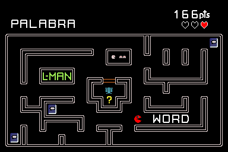
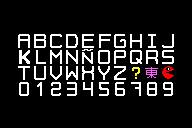

# L-Man

Juego open-source inspirado en Pac-Man; orientado hacia la práctica del inglés, mediante un sistema de recolección de letras que servirán como traducción para una palabra propuesta durante el tiempo de juego. Al iniciar el juego se mostrará una palabra en español y un laberinto lleno de letras repartidas alrededor del mapa. El jugador deberá recolectar solamente las letras que logren formar la traducción, además tendrá que enfrentarse a caracteres inválidos (enemigos) que le perseguirán.

## ABC

## Copyright
CC BY-NC 4.0

## Integrantes
- Axel Rojas Retana C36944
- Albín Monge Arias C35000
- José Pablo Brenes Coto C31289
